Exploration and analysis
================
Anne Wilson
2024-02-29

## Analysis

First I calculate the total number of rides taken by each of the two
groups, members and casual riders.

``` r
bike_share_2023_processed %>% 
  group_by(member_casual) %>% 
  summarise(number_of_rides = n())
```

    ## # A tibble: 2 × 2
    ##   member_casual number_of_rides
    ##   <chr>                   <int>
    ## 1 casual                1497410
    ## 2 member                2718466

### Ride duration

Now I look to see the range of ride lengths in each of the two groups,
members and casual riders.

``` r
bike_share_2023_processed %>% 
  group_by(member_casual) %>% 
  summarise(min_duration = min(ride_length), max_duration = max(ride_length))
```

    ## # A tibble: 2 × 3
    ##   member_casual min_duration max_duration
    ##   <chr>         <drtn>       <drtn>      
    ## 1 casual        2 mins       12136 mins  
    ## 2 member        2 mins        1498 mins

Note that the min-duration of 2 minutes here is artificial, as rides of
length less than two minutes were removed when the data was cleaned as
there were a number of extremely short rides that could not have been
real rides.

Histograms are generated to show the number of rides of different
durations for members and for casual riders. The rides have been split
into three groups - those less than an hour long, those between one and
twelve hours, and those that last over twelve hours.

``` r
bike_share_2023_processed %>% 
  filter(ride_length < 60) %>% 
  ggplot(mapping = aes(x = as.numeric(ride_length), fill = member_casual)) +
  geom_histogram(binwidth = 5, boundary = 0) +
  facet_wrap(~member_casual) +
  labs(title = "Ride Length",subtitle = "Ride length less than one hour.", x = "Ride length (minutes)", y = "Number of rides")
```

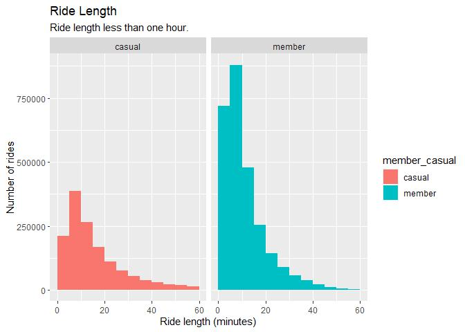<!-- -->

``` r
bike_share_2023_processed %>%
  filter(ride_length > 60 & ride_length < 720) %>% 
  ggplot(mapping = aes(x = as.numeric(ride_length)/60, fill = member_casual)) +
  scale_x_continuous(breaks = c(2,4,6,8,10,12), labels=c("2", "4", "6", "8", "10", "12")) +
  coord_cartesian(xlim = c(1, 12))  +
  geom_histogram(binwidth = 1, boundary = 1) +
  facet_wrap(~member_casual) +
  labs(title = "Ride Length",subtitle = "Ride length between 1 and 12 hours.", x = "Ride length (hours)", y = "Number of rides")
```

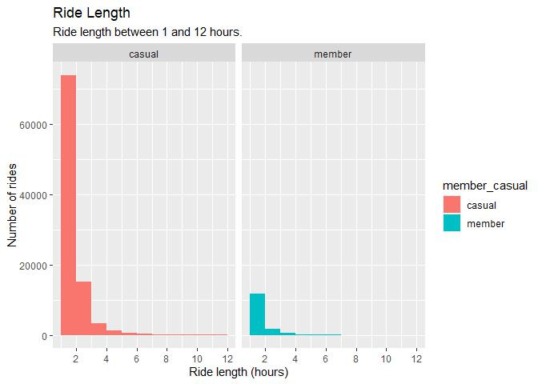<!-- -->

``` r
bike_share_2023_processed %>% 
  filter(ride_length > 720) %>% 
  ggplot(mapping = aes(x = as.numeric(ride_length)/60, fill = member_casual)) +
  geom_histogram(binwidth = 12, boundary = 12) +
  coord_cartesian(xlim = c(12, 204)) +
  scale_x_continuous(breaks = c(24,48,72,96,120,144,168,192)) +
  facet_wrap(~member_casual) +
  labs(title = "Ride Length",subtitle = "Ride length greater than 12 hours.", x = "Ride length (hours)", y = "Number of rides")
```

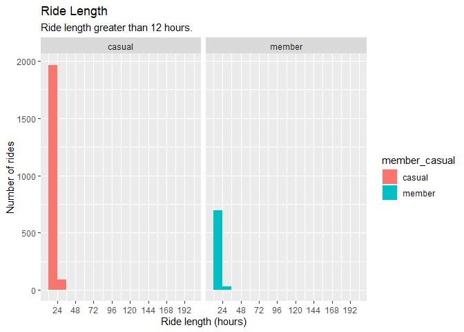<!-- -->

These histograms show that the majority of rides are less than an hour
long for both casual riders and members, but a higher proportion of the
rides made by casual riders, rather than members, are longer than an
hour. There are very few rides that are longer than 24 hours for both
groups. It should be remembered that there are many more rides by
members than by casual riders.

Most of the rides are less than 15 minutes long, and I now calculate the
percentage of these shorter rides for each group.

``` r
casual_in_interval <- nrow(bike_share_2023_processed[(bike_share_2023_processed$member_casual == "casual") &
                                 (bike_share_2023_processed$ride_length < 15),])
total_casual <- nrow(bike_share_2023_processed[(bike_share_2023_processed$member_casual == "casual"),])

member_in_interval <- nrow(bike_share_2023_processed[(bike_share_2023_processed$member_casual == "member") &
                                 (bike_share_2023_processed$ride_length < 15),])
total_member <- nrow(bike_share_2023_processed[(bike_share_2023_processed$member_casual == "member"),])

percent_casual_in_interval <- 100 * casual_in_interval / total_casual
percent_member_in_interval <- 100 * member_in_interval / total_member

percent_casual_in_interval
```

    ## [1] 54.76082

``` r
percent_member_in_interval
```

    ## [1] 73.69631

From which, it can be seen that 74% of all rides by annual members are
shorter than 15 minutes, whereas only 55% of rides by casual riders are
that short.

### When the bikes are ridden

I now consider on what day of the week the bikes are ridden, again split
by casual riders and members. This is done by looking at the day_of_week
column which gives the day on which the bike is taken out. There are
some rides that cross into the next day but for this analysis only the
start day of the ride is considered.

``` r
bike_share_2023_processed %>%
  ggplot(mapping = aes(x = day_of_week, fill = member_casual)) +
  geom_bar() +
  facet_wrap(~member_casual) +
  labs(title = "Number of Rides for each Day of the Week", x = "Day of week", y = "Number of rides (thousands)") +
  scale_x_continuous(breaks = c(1,2,3,4,5,6,7), labels=c("Sun", "Mon", "Tue", "Wed", "Thu", "Fri", "Sat")) +
  scale_y_continuous(breaks = c(0, 100000, 200000, 300000, 400000), labels = c("0", "100", "200", "300", "400"))
```

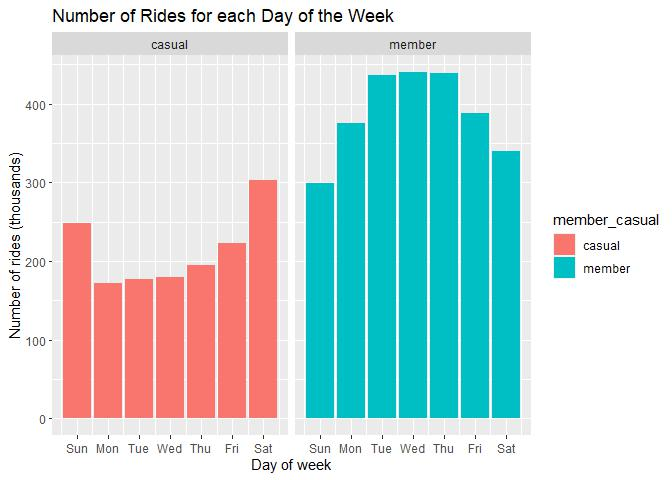<!-- -->

It can be seen the number of rides taken by casual users is highest at
the weekend, whereas there are more rides by members during the week.

Next I do the same analysis but for the months to see if there is any
difference in how members and casual riders use the bikes across the
year.

``` r
bike_share_2023_processed %>%
  ggplot(mapping = aes(x = month, fill = member_casual)) +
  geom_bar() +
  facet_wrap(~member_casual) +
  labs(title = "Number of Rides Across the Year", x = "Month", y = "Number of rides (thousands)") +
  scale_x_continuous(breaks = c(1,3,5,7,9,11), labels=c("Jan", "Mar", "May", "Jul", "Sep","Nov")) +
  scale_y_continuous(breaks = c(0, 100000, 200000, 300000, 400000), labels = c("0", "100", "200", "300", "400"))
```

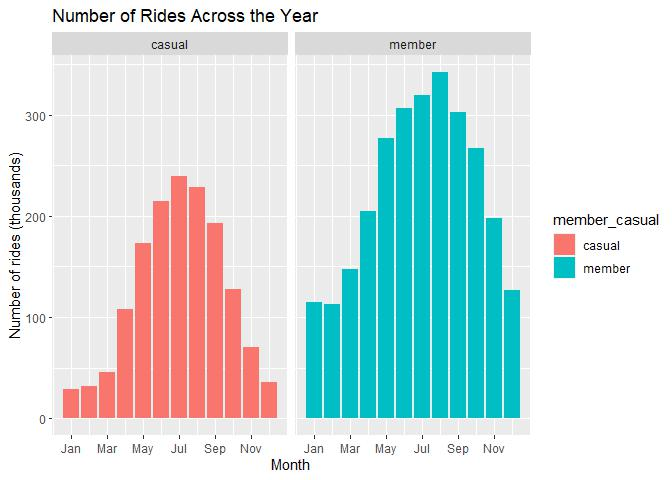<!-- -->

The pattern of rides across the year is very similar for members and
casual riders, with fewer rides by both groups in the winter months.

Finally I consider the time of day that the rides start.

``` r
bike_share_2023_processed %>%
  ggplot(mapping = aes(x = hour(started_at), fill = member_casual)) +
  geom_bar() +
  facet_wrap(~member_casual) +
  labs(title = "Number of Rides by Time of Day", x = "Time", y = "Number of rides (thousands)") +
  scale_x_continuous(breaks = c(2,6,10,14,18,22), labels=c("2:00", "6:00", "10:00", "14:00", "18:00", "22:00")) +
  scale_y_continuous(breaks = c(0, 100000, 200000, 300000, 400000), labels = c("0", "100", "200", "300", "400"))
```

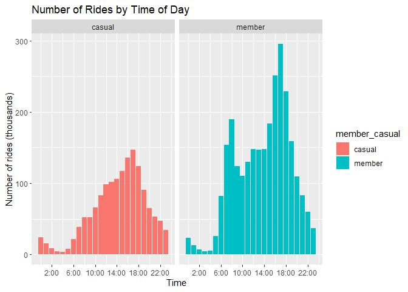<!-- -->

There are clear peaks at the start and end of the working day for
members but not for casual riders, which would suggest that fewer casual
riders are using the bikes to commute to work (or they are working more
variable hours).

### Locations

It would be interesting to see if casual riders use different stations
to members. To do this I create a new data frame (station_ride_nums)
giving the number of rides starting at each station.

``` r
station_ride_nums <- bike_share_2023_processed %>%
  select(start_station_id, start_station_name, start_lat, start_lng, member_casual) %>% 
  group_by(member_casual, start_station_id, start_station_name) %>%
  # Average the start_lat and start_lng because they differ in the later digits for the same station.
  summarise(number_of_rides = n(), start_latitude = round(mean(start_lat), 3), start_longitude = round(mean(start_lng), 3)) %>% 
  arrange(-number_of_rides)

head(station_ride_nums, 10)
```

    ## # A tibble: 10 × 6
    ## # Groups:   member_casual, start_station_id [10]
    ##    member_casual start_station_id start_station_name             number_of_rides
    ##    <chr>         <chr>            <chr>                                    <int>
    ##  1 casual        13022            Streeter Dr & Grand Ave                  42307
    ##  2 casual        13300            DuSable Lake Shore Dr & Monro…           27985
    ##  3 member        KA1503000043     Kingsbury St & Kinzie St                 23702
    ##  4 member        WL-012           Clinton St & Washington Blvd             23459
    ##  5 member        TA1307000039     Clark St & Elm St                        22554
    ##  6 casual        13042            Michigan Ave & Oak St                    20604
    ##  7 member        TA1308000050     Wells St & Concord Ln                    18763
    ##  8 casual        LF-005           DuSable Lake Shore Dr & North…           18393
    ##  9 casual        13008            Millennium Park                          18355
    ## 10 member        TA1305000032     Clinton St & Madison St                  18349
    ## # ℹ 2 more variables: start_latitude <dbl>, start_longitude <dbl>

I save this data frame to a csv file so that I can create a map
visualisation in Tableau.

``` r
write_csv(station_ride_nums, "station_ride_nums.csv")
write_rds(station_ride_nums, "station_ride_nums.RDS")
```

Next I look at the top starting stations for casual users and for
members and what proportion these make up of all rides. A data frame is
created with the numbers of rides for each station and the percentage of
casual or member rides.

``` r
df <- station_ride_nums %>% 
  group_by(member_casual) %>% 
  reframe(start_station_id, start_station_name, total_rides = sum(number_of_rides), number_of_rides, percentage_of_rides = (number_of_rides / total_rides) * 100)
```

The data frame is then filtered to show just members, and sorted by the
number of rides.

``` r
members <- df %>% 
  filter(member_casual == "member") %>% 
  arrange(-number_of_rides)
head(members, 30)
```

    ## # A tibble: 30 × 6
    ##    member_casual start_station_id start_station_name total_rides number_of_rides
    ##    <chr>         <chr>            <chr>                    <int>           <int>
    ##  1 member        KA1503000043     Kingsbury St & Ki…     2718466           23702
    ##  2 member        WL-012           Clinton St & Wash…     2718466           23459
    ##  3 member        TA1307000039     Clark St & Elm St      2718466           22554
    ##  4 member        TA1308000050     Wells St & Concor…     2718466           18763
    ##  5 member        TA1305000032     Clinton St & Madi…     2718466           18349
    ##  6 member        KA1504000135     Wells St & Elm St      2718466           18107
    ##  7 member        KA1503000071     University Ave & …     2718466           17533
    ##  8 member        13332            Loomis St & Lexin…     2718466           17288
    ##  9 member        KA1503000014     Ellis Ave & 60th …     2718466           16506
    ## 10 member        13137            Broadway & Barry …     2718466           16451
    ## # ℹ 20 more rows
    ## # ℹ 1 more variable: percentage_of_rides <dbl>

The same is then done for casual riders.

``` r
casual_riders <- df %>% 
  filter(member_casual == "casual") %>% 
  arrange(-number_of_rides)
head(casual_riders, 30)
```

    ## # A tibble: 30 × 6
    ##    member_casual start_station_id start_station_name total_rides number_of_rides
    ##    <chr>         <chr>            <chr>                    <int>           <int>
    ##  1 casual        13022            Streeter Dr & Gra…     1497410           42307
    ##  2 casual        13300            DuSable Lake Shor…     1497410           27985
    ##  3 casual        13042            Michigan Ave & Oa…     1497410           20604
    ##  4 casual        LF-005           DuSable Lake Shor…     1497410           18393
    ##  5 casual        13008            Millennium Park        1497410           18355
    ##  6 casual        15544            Shedd Aquarium         1497410           16528
    ##  7 casual        TA1308000001     Theater on the La…     1497410           14736
    ##  8 casual        KA1503000064     Dusable Harbor         1497410           14182
    ##  9 casual        13431            Adler Planetarium      1497410           11069
    ## 10 casual        TA1308000012     Montrose Harbor        1497410           10647
    ## # ℹ 20 more rows
    ## # ℹ 1 more variable: percentage_of_rides <dbl>

The most used station for casual riders is Streeter Dr & Grand Ave,
which accounts for 2.8% of all rides made by casual users. In contrast,
the most used station for members (Kingsbury St & Kinzie St) accounts
for only 0.9% of rides by members.

The same analysis for end stations is carried out below.

``` r
end_ride_nums <- bike_share_2023_processed %>%
  # Average the end_lat and end_lng because they differ in the later digits for the same station.
  select(end_station_id, end_station_name, end_lat, end_lng, member_casual) %>% 
  group_by(member_casual, end_station_id, end_station_name) %>%
  summarise(number_of_rides = n(), end_latitude = round(mean(end_lat), 3), end_longitude = round(mean(end_lng), 3))

df <- end_ride_nums %>% 
  group_by(member_casual) %>% 
  reframe(end_station_id, end_station_name, total_rides = sum(number_of_rides), number_of_rides, percentage_of_rides = (number_of_rides / total_rides) * 100)
```

Filter and sort for members.

``` r
members <- df %>% 
  filter(member_casual == "member") %>% 
  arrange(-number_of_rides)
head(members, 30)
```

    ## # A tibble: 30 × 6
    ##    member_casual end_station_id end_station_name     total_rides number_of_rides
    ##    <chr>         <chr>          <chr>                      <int>           <int>
    ##  1 member        WL-012         Clinton St & Washin…     2718466           24672
    ##  2 member        KA1503000043   Kingsbury St & Kinz…     2718466           23751
    ##  3 member        TA1307000039   Clark St & Elm St        2718466           22450
    ##  4 member        TA1305000032   Clinton St & Madiso…     2718466           19866
    ##  5 member        TA1308000050   Wells St & Concord …     2718466           19655
    ##  6 member        KA1504000135   Wells St & Elm St        2718466           18243
    ##  7 member        KA1503000071   University Ave & 57…     2718466           17887
    ##  8 member        13137          Broadway & Barry Ave     2718466           17142
    ##  9 member        13332          Loomis St & Lexingt…     2718466           17062
    ## 10 member        21544          State St & Chicago …     2718466           16771
    ## # ℹ 20 more rows
    ## # ℹ 1 more variable: percentage_of_rides <dbl>

Filter and sort for casual riders.

``` r
casual_riders <- df %>% 
  filter(member_casual == "casual") %>% 
  arrange(-number_of_rides)
head(casual_riders, 30)
```

    ## # A tibble: 30 × 6
    ##    member_casual end_station_id end_station_name     total_rides number_of_rides
    ##    <chr>         <chr>          <chr>                      <int>           <int>
    ##  1 casual        13022          Streeter Dr & Grand…     1497410           46657
    ##  2 casual        13300          DuSable Lake Shore …     1497410           25629
    ##  3 casual        13042          Michigan Ave & Oak …     1497410           21992
    ##  4 casual        LF-005         DuSable Lake Shore …     1497410           21957
    ##  5 casual        13008          Millennium Park          1497410           20793
    ##  6 casual        TA1308000001   Theater on the Lake      1497410           16379
    ##  7 casual        15544          Shedd Aquarium           1497410           14819
    ##  8 casual        KA1503000064   Dusable Harbor           1497410           12504
    ##  9 casual        TA1308000050   Wells St & Concord …     1497410           10675
    ## 10 casual        TA1308000012   Montrose Harbor          1497410           10594
    ## # ℹ 20 more rows
    ## # ℹ 1 more variable: percentage_of_rides <dbl>

The results look similar for the end stations, with the casual riders
more concentrated on a few stations.

### Numbers of rides made on electric and classic bikes

It may be that casual riders make more trips on either the electric or
the classic bikes than members do, so I plot the total number of rides
on each sort of bike for members and casual riders.

``` r
ggplot(bike_share_2023_processed, mapping = aes(x = member_casual, fill = rideable_type)) +
  geom_bar(position = position_dodge()) +
  labs(title = "Number of rides on classic and electric bikes", x = "", y = "Number of rides (millions)") +
  scale_y_continuous(breaks = c(0, 500000, 1000000, 1500000, 2000000), labels = c("0", "0.5", "1.0", "1.5", "2.0"))
```

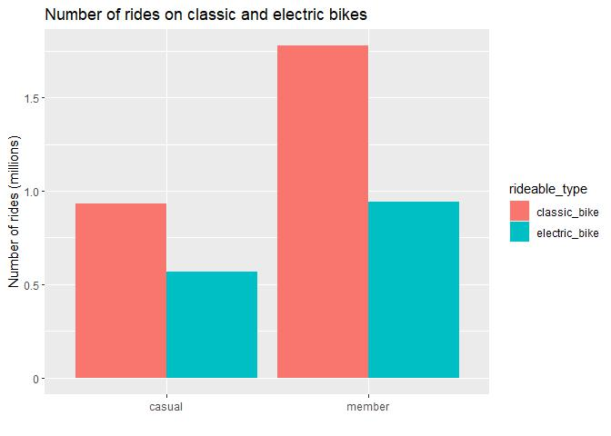<!-- -->

It can be seen that the proportion rides made by casual riders using
electric bikes is greater than that of members. The exact percentages
can be calculated to make this clearer.

``` r
electric_member_count <- 
  nrow(bike_share_2023_processed[(bike_share_2023_processed$member_casual == "member") & 
                                    (bike_share_2023_processed$rideable_type == "electric_bike"),])
classic_member_count <- 
  nrow(bike_share_2023_processed[(bike_share_2023_processed$member_casual == "member") & 
                                    (bike_share_2023_processed$rideable_type == "classic_bike"),])
electric_casual_count <- 
  nrow(bike_share_2023_processed[(bike_share_2023_processed$member_casual == "casual") & 
                                    (bike_share_2023_processed$rideable_type == "electric_bike"),])
classic_casual_count <- 
  nrow(bike_share_2023_processed[(bike_share_2023_processed$member_casual == "casual") & 
                                    (bike_share_2023_processed$rideable_type == "classic_bike"),])

percent_member_electric <- 100 * electric_member_count / (electric_member_count + classic_member_count)
percent_casual_electric <-  100 * electric_casual_count / (electric_casual_count + classic_casual_count)

percent_member_electric
```

    ## [1] 34.66069

``` r
percent_casual_electric
```

    ## [1] 37.78771

It can be seen that the difference is small, with 35% of rides by
members being on electric bikes, and 38% of rides by casual riders.

Next the number of bike rides on each type of bike is plotted for each
day of the week.

``` r
ggplot(bike_share_2023_processed, mapping = aes(x = day_of_week, fill = rideable_type)) +
  geom_bar(position = position_dodge()) +
  facet_wrap(~ member_casual) +
  labs(title = "Rides on classic and electric bikes by day of week", x = "Day", y = "Number of rides (thousands)") +
  scale_x_continuous(breaks = c(1, 2, 3, 4, 5, 6, 7), labels = c("Sun", "Mon", "Tue", "Wed", "Thu", "Fri", "Sat")) +
  scale_y_continuous(breaks = c(0, 100000, 200000, 300000), labels = c("0", "100", "200", "300"))
```

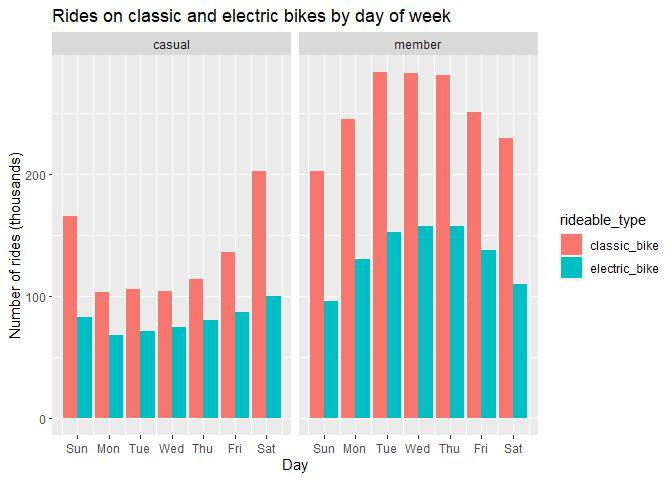<!-- -->

The pattern of usage of electric bikes is broadly similar to that for
classic bikes, but the increase in the number of rides at weekends seen
for casual riders is larger for the classic bikes than for electric
bikes. The graph suggests that more weekend riders like to ride the
classic rides, whereas in the week, while classic bikes are still used
more often, the difference is less pronounced. Now I have a look at how
this varies across the year.

``` r
ggplot(bike_share_2023_processed, mapping = aes(x = month, fill = rideable_type)) +
  geom_bar(position = position_dodge()) +
  facet_wrap(~ member_casual) +
  labs(title = "Rides on classic and electric bikes by month of year", x = "Month", y = "Number of rides (thousands)") +
  scale_x_continuous(breaks = c(1,3,5,7,9,11), labels=c("Jan", "Mar", "May", "Jul", "Sep","Nov")) +
  scale_y_continuous(breaks = c(0, 50000, 100000, 150000, 200000, 250000), labels = c("0", "50", "100", "150", "200", "250")) 
```

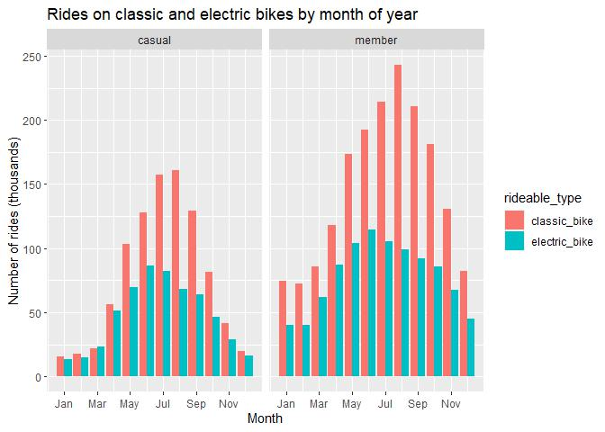<!-- -->

And finally by time of day.

``` r
ggplot(bike_share_2023_processed, mapping = aes(x = hour(started_at), fill = rideable_type)) +
  geom_bar(position = position_dodge()) +
  facet_wrap(~ member_casual) +
  labs(title = "Rides on classic and electric bikes by time of day", x = "Time", y = "Number of rides (thousands)") +
  labs(title = "Number of Rides by Time of Day", x = "Time", y = "Number of rides (thousands)") +
  scale_x_continuous(breaks = c(2,6,10,14,18,22), labels=c("2:00", "6:00", "10:00", "14:00", "18:00", "22:00")) + 
  scale_y_continuous(breaks = c(0, 50000, 100000, 150000, 200000), labels = c("0", "50", "100", "150", "200"))
```

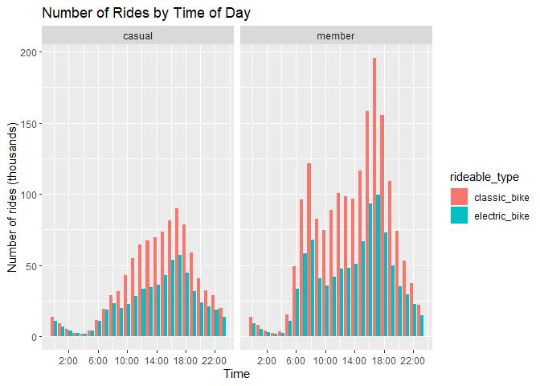<!-- -->

These two plots show that a larger proportion of electric bikes are used
in the winter and this effect is more pronounced for the casual riders.
Also, for both members and casual riders, a higher proportion of rides
are made by electric bikes at night. Since there are far fewer rides
made in the winter and at night, it is possible this change in the
proportion of electric bikes used is partly driven by availability. If
there is a limited number of electric bikes, it may be that during
summer days they are all in use and only classic bikes are available for
many users.

### Some summary statistics.

I calculate the mean ride length for members and for casual riders. I
filter the data here to look at just those rides that are shorter than
24 hours to avoid the few exceptionally long rides skewing the data.

``` r
bike_share_2023_processed %>% 
  filter(ride_length < 1440) %>% 
  group_by(member_casual) %>% 
  summarise(mean_ride_length = mean(ride_length))
```

    ## # A tibble: 2 × 2
    ##   member_casual mean_ride_length
    ##   <chr>         <drtn>          
    ## 1 casual        23.32201 mins   
    ## 2 member        12.46157 mins

And then look at the mean ride length for each day of the week for the
two groups to see if there is a difference across the week. I filter the
data here to look at just those rides that are shorter than 24 hours to
avoid the few exceptionally long rides skewing the data.

``` r
days_of_rides <- bike_share_2023_processed %>%
  filter(ride_length < 1440) %>% 
  group_by(day_of_week, member_casual) %>% 
  summarise(mean_ride_length = mean(ride_length))

ggplot(days_of_rides, mapping = aes(x = day_of_week, y = as.numeric(mean_ride_length), fill = member_casual)) +
  geom_col() +
  facet_wrap(~member_casual) +
  labs(title = "Mean ride duration for each day of the week", x = "Day of week", y = "Mean ride length (minutes)") +
  scale_x_continuous(breaks = c(1,2,3,4,5,6,7), labels=c("Sun", "Mon", "Tue", "Wed", "Thu", "Fri", "Sat"))
```

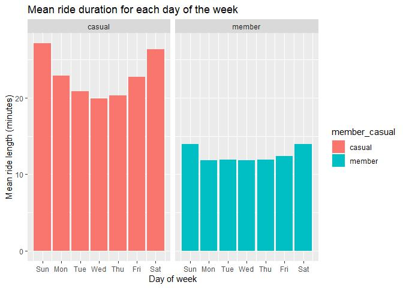<!-- -->

It can be seen that the rides are longer at the weekends for both
members and casual riders, but for members the mean ride length is very
similar for all week days whereas, for casual users, it is higher at the
beginning and end of the week.

Next I consider the mean ride lengths by time of day (with rides over 24
hours excluded).

``` r
times_of_rides <- bike_share_2023_processed %>%
  filter(ride_length < 1440) %>% 
  group_by(hour_of_day = hour(started_at), member_casual) %>% 
  summarise(mean_ride_length = mean(ride_length))

ggplot(times_of_rides, mapping = aes(x = hour_of_day, y = as.numeric(mean_ride_length), fill = member_casual)) +
  geom_col() +
  facet_wrap(~member_casual) +
  labs(title = "Mean ride duration for each hour of the day", x = "Time of day", y = "Mean ride length (minutes)") +
  scale_x_continuous(breaks = c(2,6,10,14,18,22), labels=c("2:00", "6:00", "10:00", "14:00", "18:00", "22:00"))
```

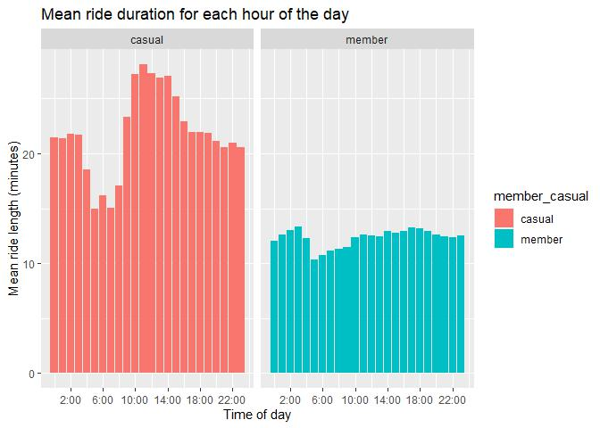<!-- -->

There is much more variation across the day for the casual riders, with
rides starting between 9am and 3pm having the longest average ride
length, a peak which is not seen for the members.

### Conclusions

The data shows that there are more rides made by casual riders at
weekends and during the middle of the day, and that those rides tend to
be longer. In contrast rides made by members tend to be shorter and peak
at the start and end of the working day. This information, taken
together with the popularity of the stations at tourist destinations for
casual riders, suggest that a larger proportion of the casual rides are
for leisure, whereas the members’ rides are more often short rides in
the week, including commuting to and from work.
