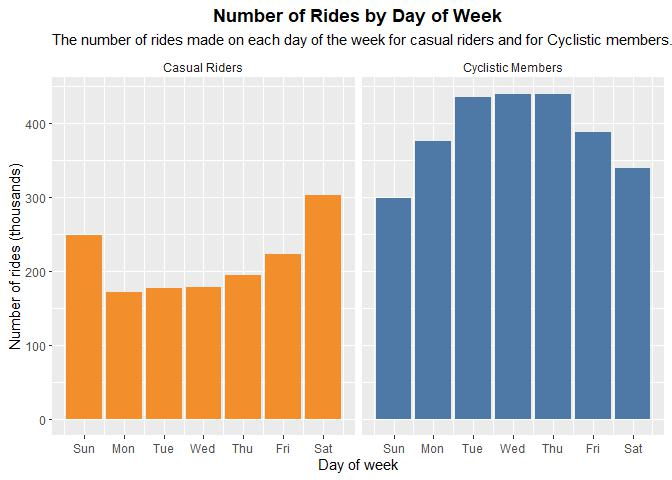
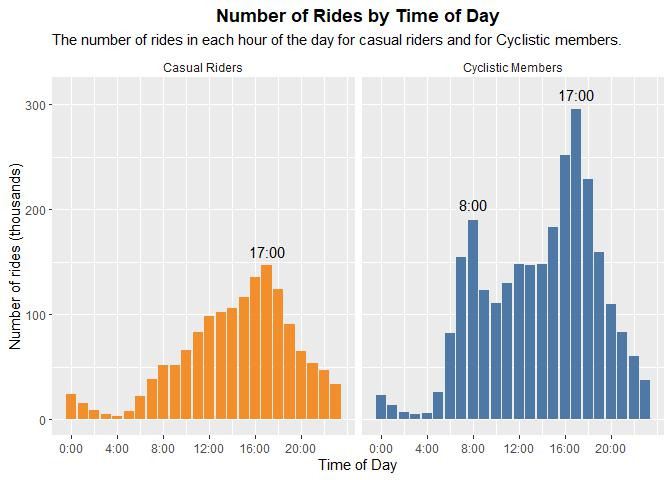
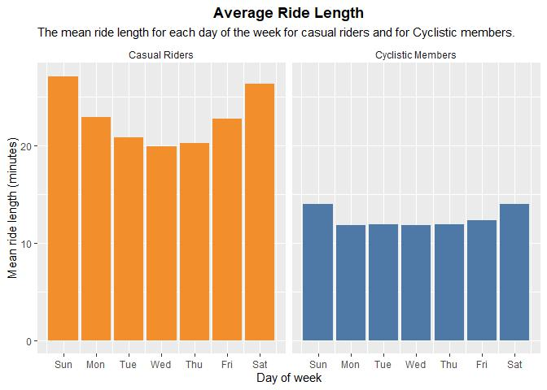
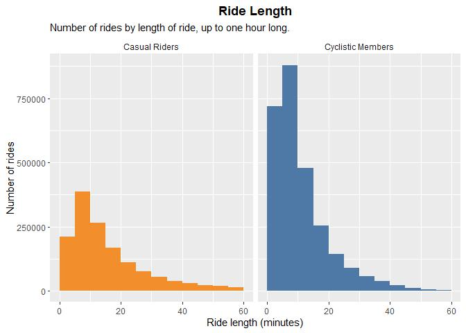
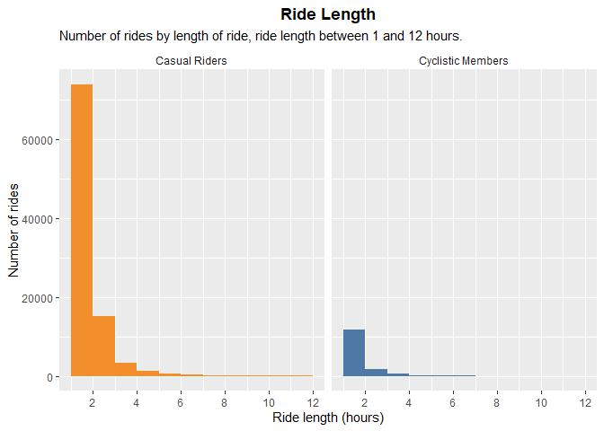
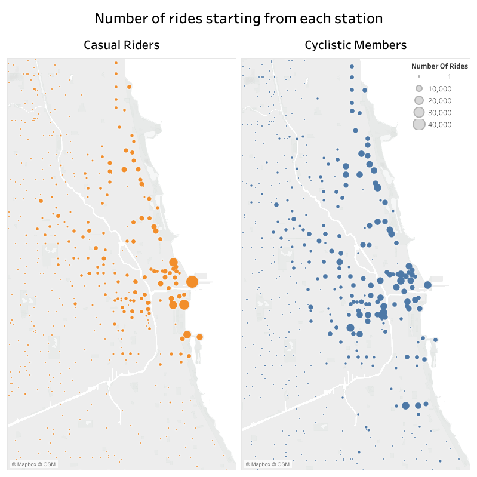

A report on the findings of the Cyclistic bike-share analysis
================
2024-02-29

# Case study: How does a bike-share navigate speedy success?

## Business task

Identify how annual members and casual riders differ in their use of
Cyclistic bikes to understand why casual riders might choose to buy
Cyclistic annual memberships and how digital media could influence them
to do so.

## Data

I decided to use data for the most recent complete year - that is for
2023. The data includes details for each ride: start time, end time, the
station the ride started from, the station it ended at and the type of
rider (member or casual). A limitation of this data is that it is not
possible to determine how individual riders are using the bikes - there
could be relatively few riders using the bikes every day, several times
a day, or there could be lots of riders taking the bikes out just once
or twice in the year. This is something that could be very different
between members and casual riders, and is important to take note of when
considering whether casual riders are likely to choose to become
members.

## Analysis

The results of my analysis showed some differences in both the time of
day and the day of the week that the bikes were used by the two groups
of riders. There were also differences in the lengths of the rides and
the stations which were most used. I also looked at variations in the
number and length of rides across the year, but these were very similar
for both groups of riders. The differences suggest that more of the
rides made by casual riders are for leisure, whereas for members they
are more likely to be for commuting.

### Number of trips by day of week

Looking at the number of rides taken on each day of the week for each
group, it can be seen that, while the number of trips by members is at
its highest on week days, the reverse is true for casual riders - they
are using the bikes most often at weekends.

<!-- -->

### Number of rides by time of day

The plot shows the number of rides taken for each hour of the day for
each group of riders. The number of rides made by casual riders
gradually increases through the day until 5pm and then decreases. The
number of rides made by the Cyclistic members has two peaks, at 8am and
5pm, suggesting a lot of these rides are for commuting to work.

<!-- -->

### Average ride length by day of week

The maximum ride length for members is 25 hours and for the casual
riders, it is over eight days. However, very few of the rides are over
24 hours and it is possible that some of these could be due to people
failing to return the bikes correctly. The data used here to calculate
the mean has been filtered to exclude all rides longer than 24 hours.

The plot shows the mean length of the rides taken by each group. It can
be seen that the rides taken by the casual riders are on average longer
that those taken by the members, particularly at weekends. Taken across
the whole week, the mean ride length for casual riders is 23 minutes and
for members, it is 12 minutes.

<!-- -->

A closer look at the distribution of those rides is given in the two
plots below. It can be seen that the bulk of the rides for both members
and casual riders are shorter than 15 minutes, but a higher proportion
of the rides taken by casual riders are longer.

<!-- -->

<!-- -->

### Number of rides from each station

A map for each group of riders, showing the number of rides starting
from each station, has been produced using Tableau. For casual riders, a
few stations account for a large number of rides - these stations are at
tourist locations or along the lake shore. For members, there are a lot
of stations that are moderately busy, and these are scattered throughout
the business districts of Chicago, including the tourist locations.

<figure>

<figcaption aria-hidden="true">Map of Chicago area with bike_share
stations sized to show the number of rides starting there for casual
riders and Cyclistic members</figcaption>
</figure>

### Use of electric and classic bikes

There are two types of bike available in the Cyclistic bike-share
scheme - electric bikes and classic bikes. The proportion of rides made
on electric bikes was slightly higher for casual riders (38%) than for
members (35%) but the difference is small. The use of electric and
classic bikes by both groups showed a similar pattern across the week
and across the year.

## Conclusions

The number of rides for the casual rider group is highest at weekends
and does not show the rush hour peaks that are seen for members,
suggesting that few of the casual riders are using the bikes for
commuting. The average ride length for casual riders is longer, though
most rides for both groups are less than 20 minutes long. This
information, together with the locations of the stations most used by
casual riders, suggest that a high proportion of the rides taken by
casual riders are for leisure rather than work.

## Recommendations

Any digital marketing to persuade casual riders to become members should
focus on the benefits of membership for those using the bikes for
leisure activities, at weekends and for longer rides. It should be
considered, however, that a lot of the casual rides could be by visitors
to the city or by people who only wish to use the bikes once or twice a
year. These people are unlikely to want to become members. If there is
data available that includes some rider information, further analysis
could be done to identify how many people are using the bikes regularly
and how many very rarely. This is important to consider when working out
how successful a digital media campaign is be likely to be.
